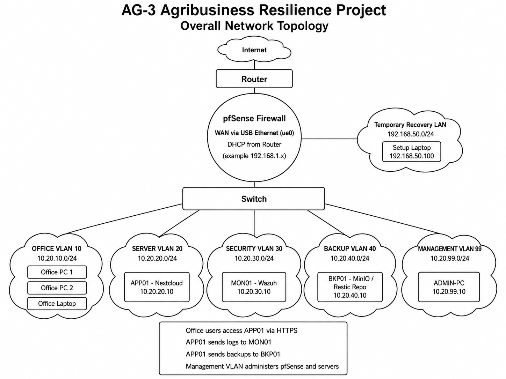
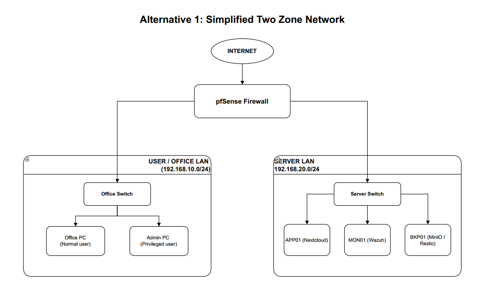
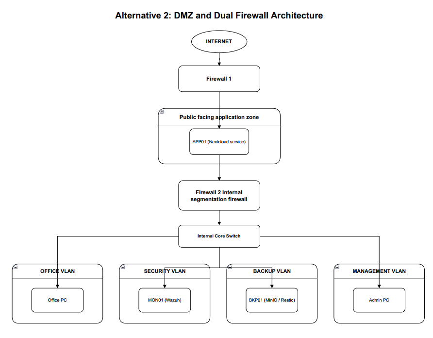
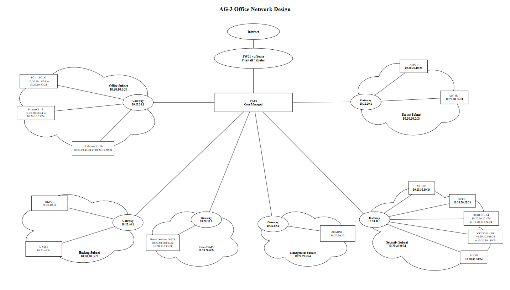
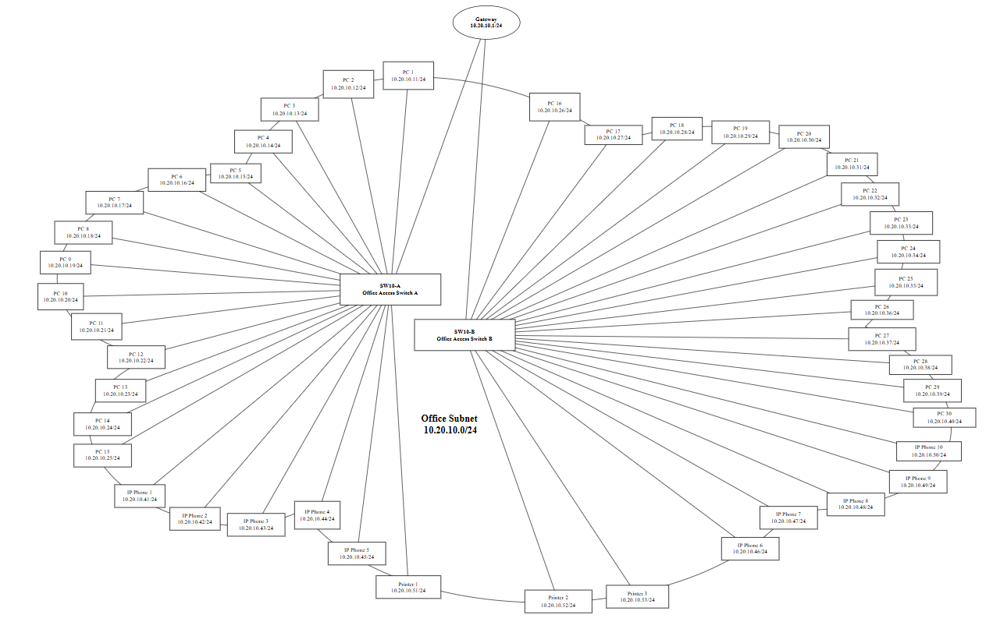
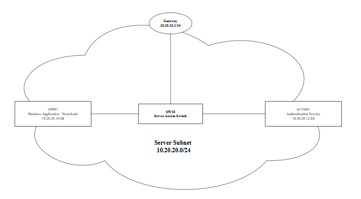
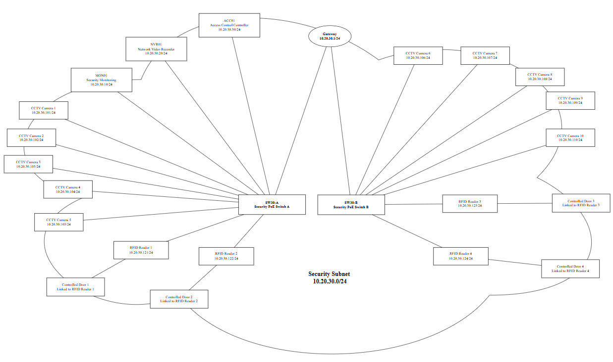
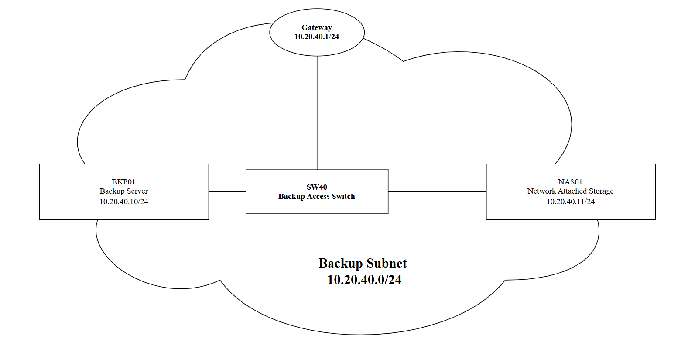
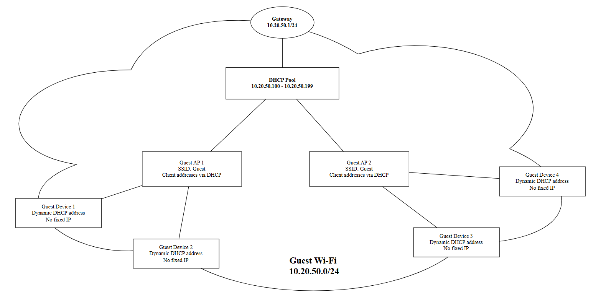

# Evidence — Akib (Network Architecture)

Workstream: pfSense, VLANs, firewall rules.

| Evidence item | Status |
|---|---|
| Editable architecture diagram source file | ☑ |
| pfSense configuration export | ☑ |
| Screenshots of VLAN interfaces and firewall rules | ☑ |
| Completed IP addressing table | ☑ |
| Successful connectivity-test results (approved paths) | ☐ |
| Failed connectivity-test results (unauthorised paths) | ☐ |
| Firewall logs showing denied traffic | ☐ |
| GitHub commits and pull-request reviews | ☐ |
| Kanban cards linked to configs/tests | ☐ |
| Teams discussion explaining firewall-rule decisions | ☐ |

## Network Topology:

## IP table:

| Network / Device     | VLAN | IP Address / Subnet     | Gateway             | Purpose                               |
| -------------------- | ---: | ----------------------- | ------------------- | ------------------------------------- |
| **WAN**              |    — | `192.168.1.x/24`        | Home/Router gateway | Internet connection                   |
| **Temporary LAN**    |    — | `192.168.50.0/24`       | `192.168.50.1`      | Temporary pfSense management/recovery |
| Setup Laptop         |    — | `192.168.50.100`        | `192.168.50.1`      | Initial pfSense configuration         |
| **OFFICE**           |   10 | `10.20.10.0/24`         | `10.20.10.1`        | Office users and Windows clients      |
| Office Clients       |   10 | `10.20.10.100–199`      | `10.20.10.1`        | Normal office devices                 |
| **SERVER**           |   20 | `10.20.20.0/24`         | `10.20.20.1`        | Application/server network            |
| APP01 – Nextcloud    |   20 | `10.20.20.10`           | `10.20.20.1`        | Business records and Nextcloud        |
| **SECURITY**         |   30 | `10.20.30.0/24`         | `10.20.30.1`        | Security monitoring network           |
| MON01 – Wazuh        |   30 | `10.20.30.10`           | `10.20.30.1`        | Wazuh SIEM and monitoring             |
| **BACKUP**           |   40 | `10.20.40.0/24`         | `10.20.40.1`        | Isolated backup network               |
| BKP01 – MinIO/Restic |   40 | `10.20.40.10`           | `10.20.40.1`        | Encrypted backup repository           |
| **MANAGEMENT**       |   99 | `10.20.99.0/24`         | `10.20.99.1`        | Administrator-only network            |
| ADMIN-PC             |   99 | `10.20.99.10`           | `10.20.99.1`        | pfSense and server administration     |

## Alternative Designs: 

## Detailed network design for the selected architecture:

