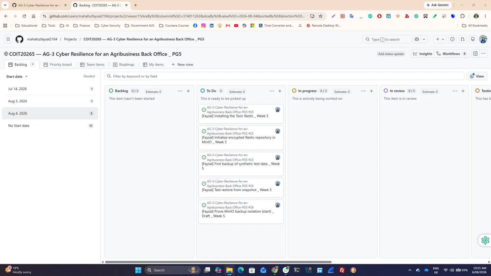
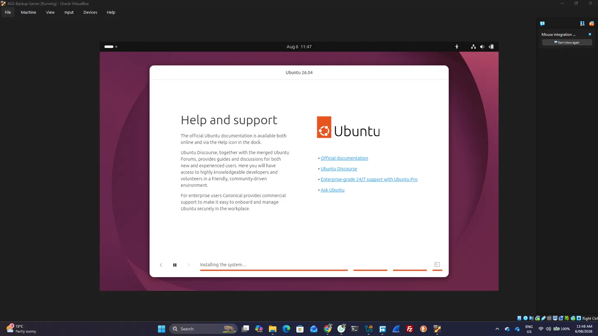
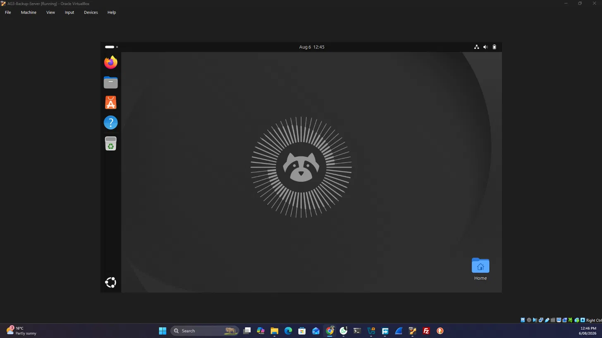
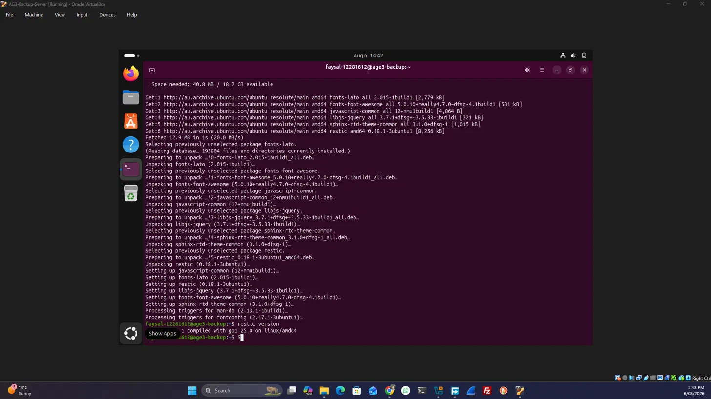
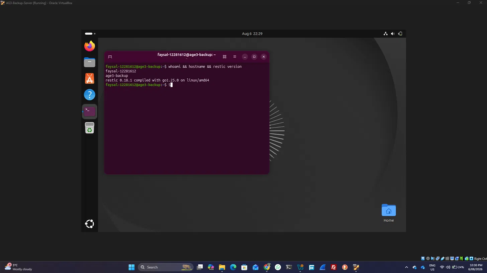
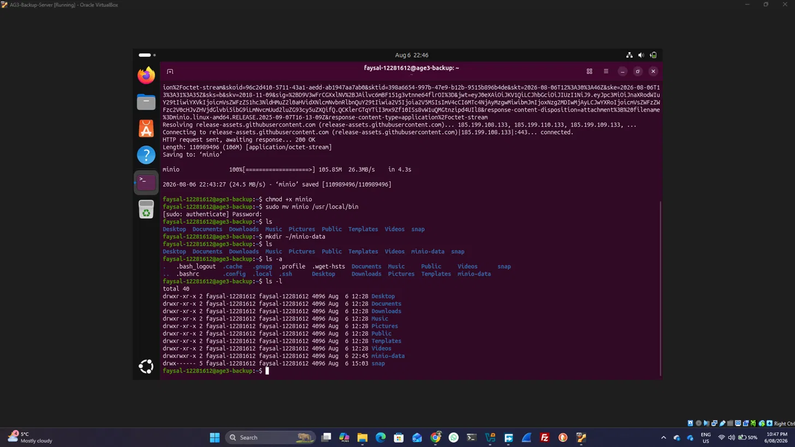
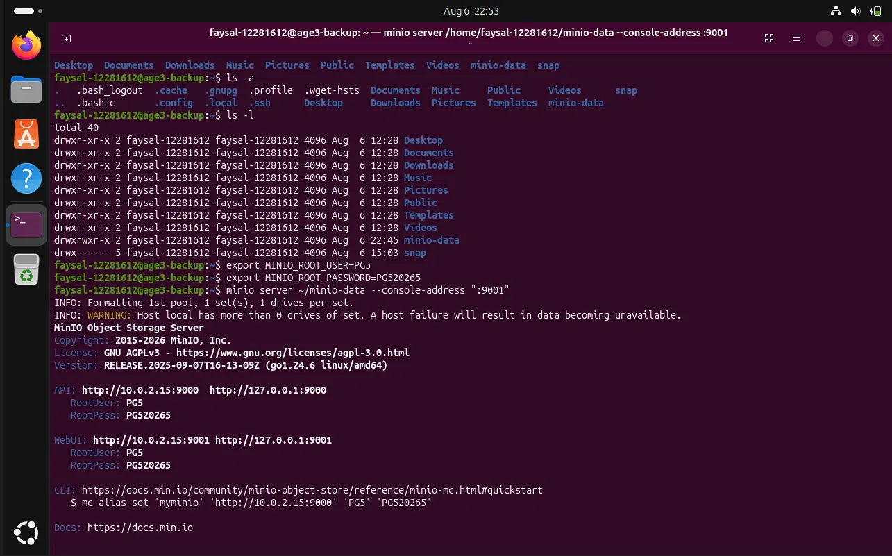
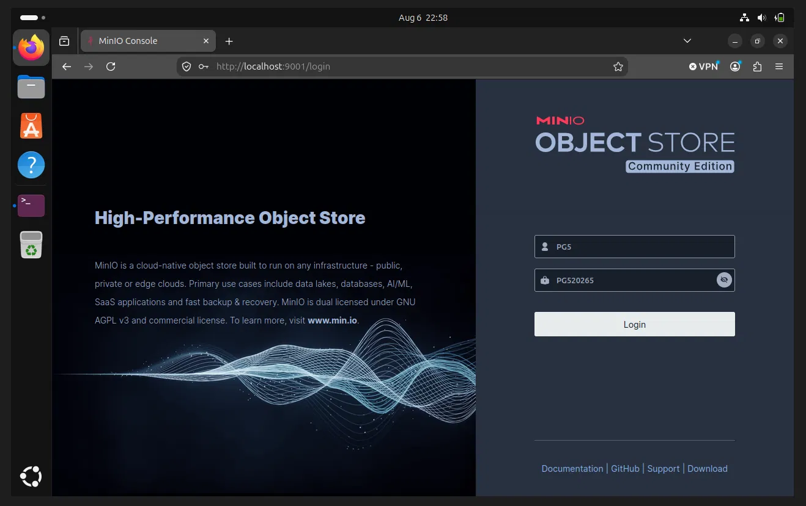

# Week 5 — Backup Workstream Progress (Faysal)

**Workstream:** Restic/MinIO backup, automation and recovery
**Week 5 goal:** Get the backup foundation running — install the tools, create a first encrypted repository in MinIO, take a first backup of synthetic test data, and confirm I can list and restore snapshots.

## Planned tasks (Kanban board)

The screenshot below shows my Week 5 backup cards created and assigned on the team Kanban board:

## Week 5 task list

- [ ] **Environment Setup in Oracle VirtualBox**

- [ ] **Installing the tool: Restic**
  
  
  
- [ ] **Installing the tool: MinIO**  
   
  
  
  

- [ ] **Initialize encrypted Restic repository in MinIO**

- [ ] **First backup of synthetic test data**

- [ ] **Test restore from snapshot**

- [ ] **Prove MinIO backup isolation (start)**

## Problems Faced to Complete these tasks and Solutions to Get rid of the problem  

| Serial | Problem | Description | Solution |
|---|---|---|---|
| 01 | Setting up Work Environment | Whether to select Local (Ubuntu VM Local) or an environment that supports Teams collaboration (Cloud VM). On a local server (Ubuntu VM Local), I cannot use Teams for collaboration, but adding Teams collaboration (Cloud VM) will be costly. | Ubuntu VM (I will add a secure overlay like Tailscale/ZeroTier/WireGuard later on)  
| 02 | AAA | AAA | AAA |  
| 03 | AAA | AAA | AAA |  

## Evidence to collect this week

- Screenshot of successful repository initialisation
- Screenshot of `restic snapshots` and `restic check` output
- Screenshot of a successful restore
- Proof that a normal office account cannot reach MinIO
- All committed to this folder with dated filenames
