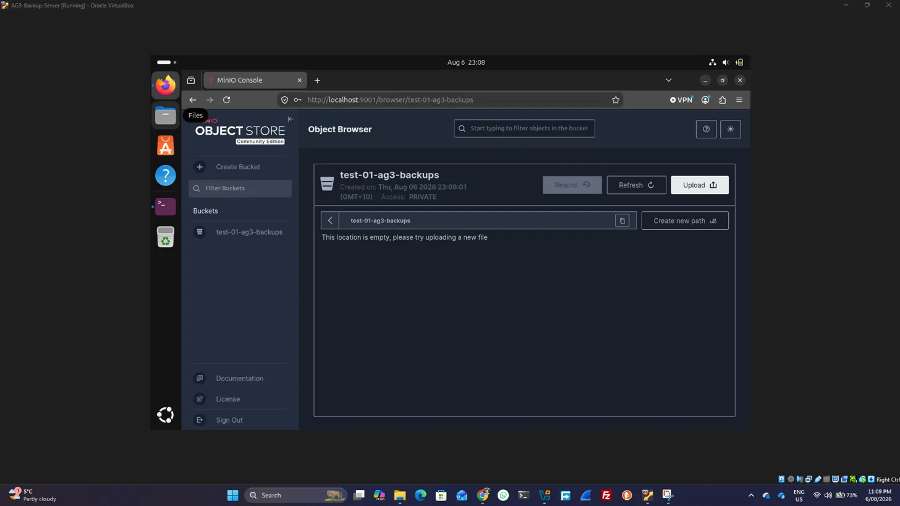

# Week 5 — Backup Workstream Progress (Faysal)

**Workstream:** Restic/MinIO backup, automation, and recovery  
**Week 5 goal:** Get the backup foundation running — install the tools, create a first encrypted repository in MinIO, take a first backup of synthetic test data, and confirm I can list and restore snapshots.  

## Planned tasks (Kanban board)

The screenshot below shows my Week 5 backup cards created and assigned on the team Kanban board:

_N.B. A lot of changes happen after even taking this screenshot. This screenshot was taken just after initial planning._

## Week 5 task list

- [ ] **Environment Setup in Oracle VirtualBox**

- What I did: Set up the backup environment from scratch. Created a VM in VirtualBox (AG3-Backup-Server, 4 GB RAM, 2 CPUs, 30 GB disk, NAT network), installed Ubuntu Desktop 26.04 with an interactive install, chose no disk encryption and the default ext4 filesystem, and created a dedicated user account. This VM became the platform for installing Restic and MinIO.

- Issues faced and fixed: Unattended install was ticked by default; this would auto-configure everything and cause problems. Fixed by unticking "Proceed with Unattended Installation" so I could install manually and keep control. Confused by encryption/filesystem options. Unsure whether to encrypt or pick a special filesystem. Decided on "No encryption" and default ext4, since Restic handles backup encryption and MinIO handles isolation, so full-disk encryption wasn't needed for a lab VM.
Accidentally shut the VM off mid-work; worried I'd lost progress. Learned that everything installed stays on the VM disk; only the running MinIO process and session variables needed restarting.

- Outcome: A working Ubuntu VM running in VirtualBox, ready to host the backup tools, with resources sized appropriately and network set to NAT (overlay VPN planned later for team access).

- What I learned: A VM's virtual disk is fully isolated from the host, so "erase disk" during install is safe; unattended install should be avoided when learning; the environment choice (local NAT now, overlay later) supports making the build team-accessible without rebuilding.

---

- [ ] **Installing the tool: Restic**
- What I did: Installed Restic (the backup engine) on the Ubuntu VM. Created the VM in VirtualBox, installed Ubuntu Desktop, opened the terminal, updated the package list with `sudo apt update`, installed Restic with `sudo apt install restic -y`, and confirmed it worked by running restic version, which returned a version number: **0.18.1**

- Issues faced and fixed: New to the Linux terminal, password entry shows nothing on screen when typing sudo commands, which was confusing at first. Learned this is normal Linux behaviour (hidden input) and continued. Chose the right setup during VM creation, avoided the "unattended installation" option and disk encryption, so I could install manually and keep the lab VM simple. Selected "No encryption" and the default ext4 filesystem.

- Outcome: Restic installed successfully and restic version returned a valid version number, confirming the backup engine was ready to use.

- What I learned: sudo runs commands with admin rights and hides password input; apt is Ubuntu's package installer; the VM's virtual disk is fully isolated from the real laptop, so "erase disk" during install was safe.

  
   

---

- [ ] **Installing the tool: MinIO**

- What I did: Installed the MinIO server (the isolated backup storage) on the Ubuntu VM. Downloaded the MinIO binary with wget, made it executable with `chmod +x`, moved it to /usr/local/bin/, created a data folder (~/minio-data), set the admin credentials (user **PG5**, password **PG520265**), and started the server. Then opened the console in Firefox at localhost:9001, logged in successfully, and created the bucket **test-01-ag3-backups**.

- Issues faced and fixed: Environment variables are session-only; the `MINIO_ROOT_USER` and `MINIO_ROOT_PASSWORD` exports clear on restart, so MinIO has to be relaunched with them each session. Managed by re-running the export and start commands after any restart. MinIO runs in the foreground, occupying the terminal while running, so closing that terminal stops the server. Handled by leaving it running in its own terminal and opening a second terminal for other commands.

- Outcome: MinIO server started successfully (API on port 9000, console on 9001), the console loaded in the browser, login worked, and the backup bucket was created and ready to receive the encrypted Restic repository.

- What I learned: MinIO's API port (9000) and console port (9001) are different and used for different purposes; the server must stay running in its own terminal; credentials set at startup become the console login.

   
  
  
   

---

- [ ] **Initialize encrypted Restic repository in MinIO**

- What I did: I connected Restic to MinIO and created an encrypted backup repository. Started MinIO, created the bucket **test-01-ag3-backups**, set the connection variables (access key, secret key, repository path, password), ran restic init, and verified with restic snapshots.

- Issues faced and fixed: Shut the VM off mid-task; on restart, MinIO and my environment variables were gone. Fixed by restarting the VM, relaunching MinIO, and re-entering the exports. No data lost (MinIO stores to disk).
"Secret is empty" error typo: wrote `AWS_SECRET_ACCESS_KEY_ID` instead of `AWS_SECRET_ACCESS_KEY`. Fixed by correcting the variable name.
Password not set typo: wrote `RESTIC_PASSWOR` (missing D). Fixed by correcting to `RESTIC_PASSWORD`.
- Outcome: After fixing the typos, restic init succeeded: "Created restic repository 046d89d603" and the repository opened cleanly. The encrypted repository is now live and ready for backups.
- What I learned: Environment variables clear on restart (must re-set each session or save to a file); exact variable names matter; the repository password is critical and irrecoverable if lost.
   

---  

- [ ] **First backup of synthetic test data**

    

---  

- [ ] **Test restore from snapshot**

  

---

- [ ] **Prove MinIO backup isolation (start)**

  

---

## Problems Faced to Complete these tasks and Solutions to Get rid of the problem  

| Serial | Problem | Description | Solution |Reference Picture |
|---|---|---|---|---|
| 01 | Setting up Work Environment | Whether to select Local (Ubuntu VM Local) or an environment that supports Teams collaboration (Cloud VM). On a local server (Ubuntu VM Local), I cannot use Teams for collaboration, but adding Teams collaboration (Cloud VM) will be costly. | Ubuntu VM (I will add a secure overlay like Tailscale/ZeroTier/WireGuard later on)| - |  
| 02 | CaseSensitive |  Creating Bucket Name in MinIO. It was not accepting capital letters or any spaces as characters.  | All should be in lowercase and should not have spaces, so I have used adash (-) to make it easy. "test-01-ag3-backups" | - |   
| 03 | How does MinIo & Restic Works? | I thought it was similar to a backup, and ransomware always tries to find backup folders. So, even if we are keeping data in another platform, ransomware will find it. | I found that MinIO will be located in a separate VLAN and will use different credentials, while Restic is a smart backup engine that helps to back up to MinIO separately in a different VLAN, according to Claude AI. I used Claude to get knowledge for this. | - | 
| 04 | Error in Typing in While initialization | I made some typing mistakes while setting up the tools and give me this error: _"Fatal: unable to open S3 backend: Secret ($AWS_SECRET_ACCESS_KEY) is empty"_ | Used Claude to check the Error and found out that it's a typing error. |   |  
| 05 | AAA | AAA | AAA | - |
| 06 | AAA | AAA | AAA | - |

## Evidence to collect this week

- Screenshot of successful repository initialisation
- Screenshot of `restic snapshots` and `restic check` output
- Screenshot of a successful restore
- Proof that a normal office account cannot reach MinIO
- All committed to this folder with dated filenames
