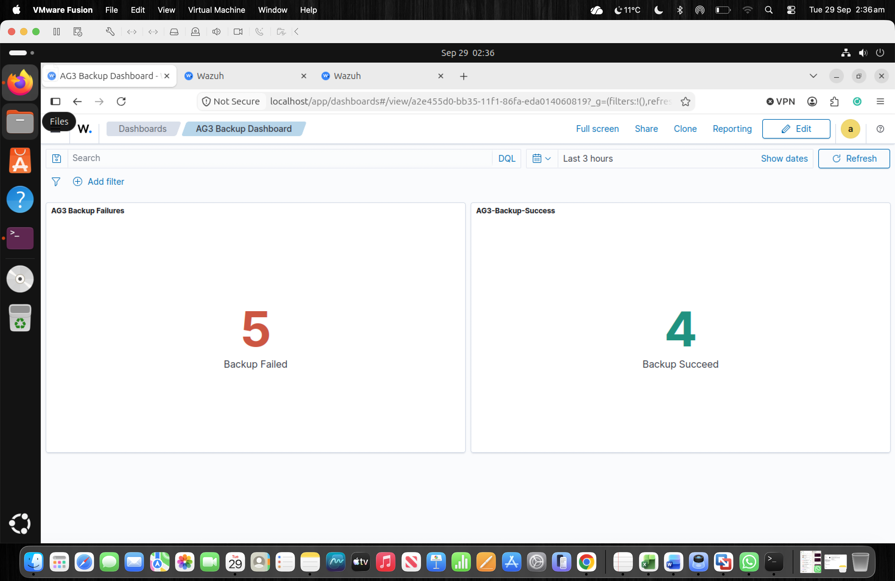

# Backup results for BKP01 via APP01
  

## Backup Detection on MON01  
The monitoring of the backup result logs made by APP01 is done using the Wazuh monitoring system. Every time there is a scheduled backup operation for APP01 using Restic backup tool on BKP01, then there is always a log that appears stating whether it is a BACKUP_SUCCESS or a BACKUP_FAILED event. The Wazuh agent sends the logs to MON01, which is able to interpret the information from the logs and shows an alert about them. There were five BACKUP_SUCCESS and four BACKUP_FAILED events during tests on MON01.  
