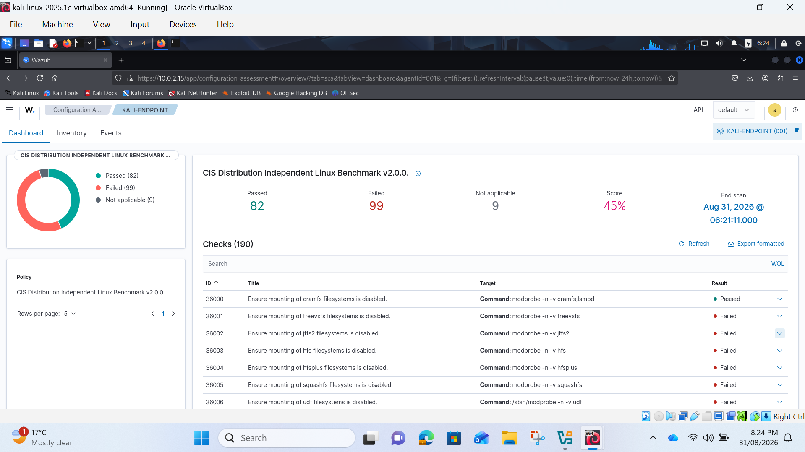
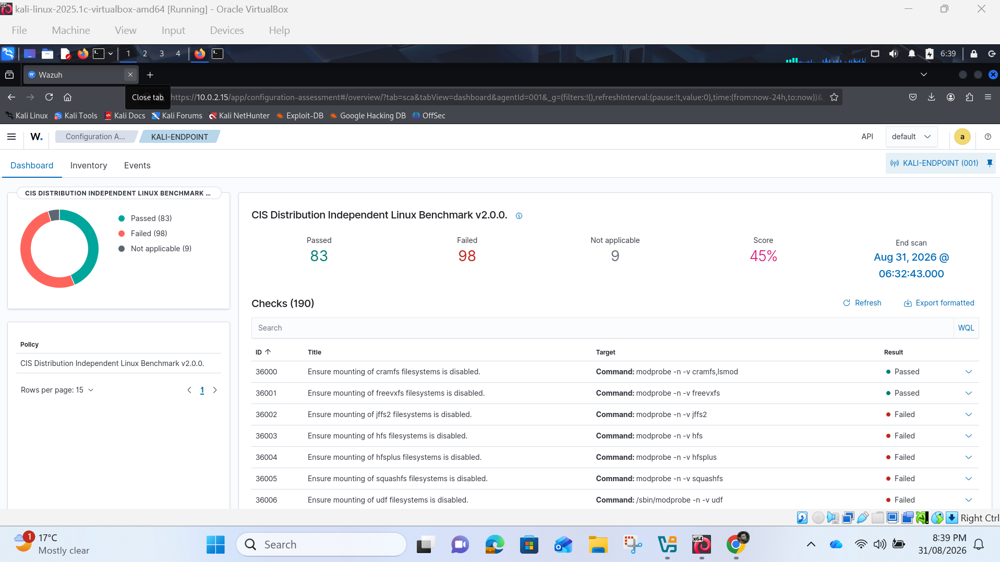
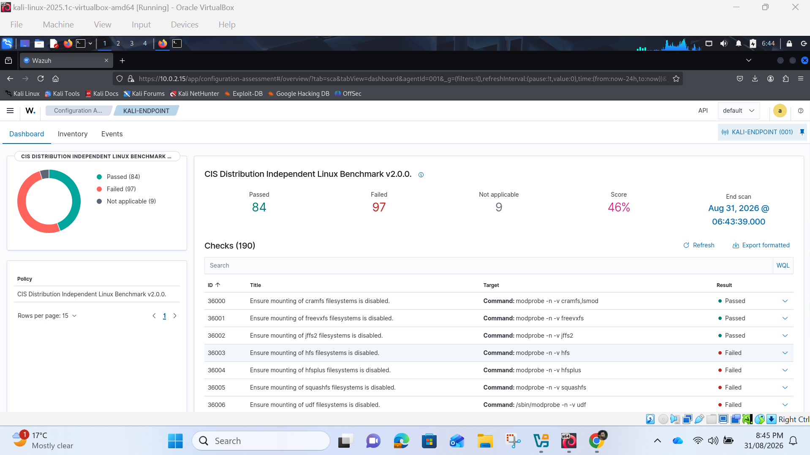
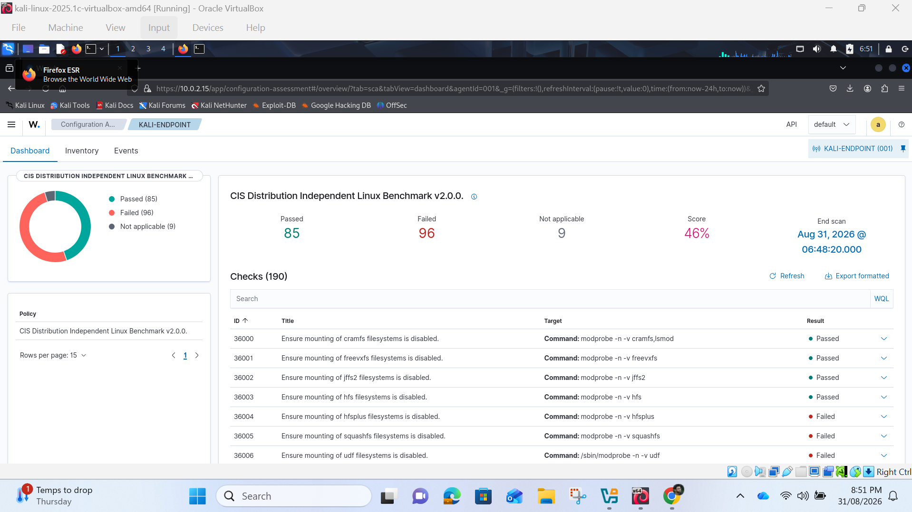
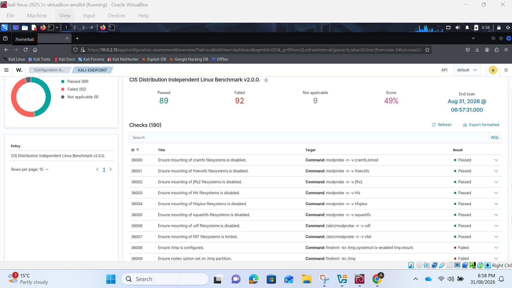
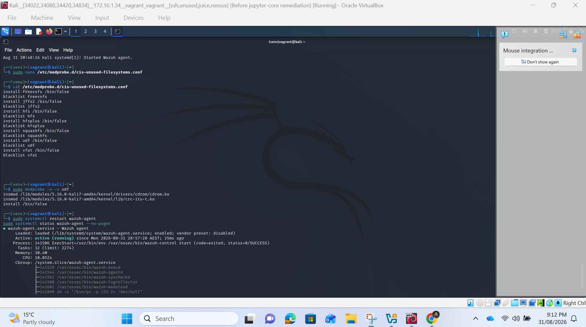
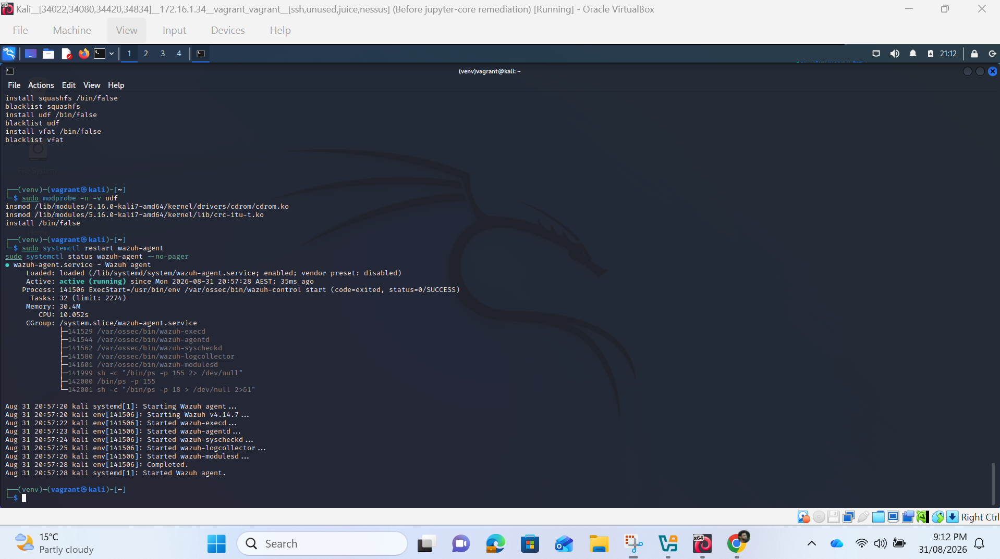

# CIS Hardening
  
  
  
  
  
  
  

## Explanation:  
The following screenshots represent CIS security hardening steps of the Kali Linux endpoint under monitoring of Wazuh. The first Security Configuration Assessment revealed 82 passed controls, 99 failed controls and compliance score 45%.  
The hardening step consisted of the reduction of the attack surface by removal of unnecessary filesystem modules. The configuration file cis-unused-filesystems.conf was created in /etc/modprobe.d/ directory. Specific rules were defined to block the loading of unused filesystems like cramfs, freevxfs, jffs2, hfs, hfsplus, squashfs, and udf. All these modules were configured using restrictive install directive and blacklist directive.  
After completing the configuration file and restart of the Wazuh agent with the help of command systemctl restart wazuh-agent, MON01 was able to re-check the state of the endpoint again. The next assessments demonstrated certain improvement: passed controls increased from 82 to 89, failed controls decreased from 99 to 92, while the CIS compliance score increased from 45% to 49%.  
Thus, it can be concluded that Wazuh managed to identify security problems with configuration, helped with hardening them and verify the results of the hardening. Even though there were 92 failed controls left, it proves that the process of hardening is repeatable.  
