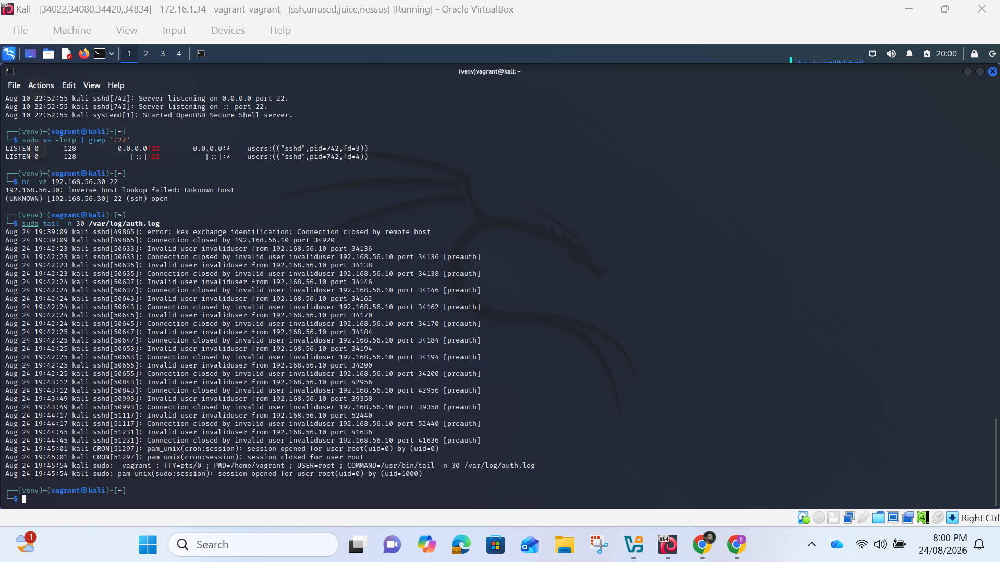

## Failed login Detection in Wazuh
  

  

  

# Explanation:  
Failed-login monitoring is important because repeated unsuccessful authentication attempts may indicate password guessing, brute-force activity, use of stolen credentials or an attempt to discover valid usernames. A single failed login can be an ordinary mistake, but several attempts from the same source within a short period require investigation. Central monitoring also creates evidence that can be reviewed after an incident.  
I used SSH authentication as the test case. The monitored Kali endpoint produced authentication messages in /var/log/auth.log. Controlled connection attempts were made from source address 192.168.56.10 using the deliberately invalid username invaliduser. This avoided using or exposing a real account.  
The source log contained repeated entries such as:  
Invalid user invaliduser from 192.168.56.10 port 34136  
Connection closed by invalid user invaliduser 192.168.56.10 port 34136 [preauth]  
Similar entries appeared from several source ports within a short period. The changing source port is normal because the client creates a new network connection for each attempt. The important investigation fields were the event time, target service (sshd), invalid username, source IP address, source port and the [preauth] status.  
The endpoint generated the SSH log entries first. The Wazuh agent collected the logs and forwarded them to the Wazuh manager. Wazuh decoded the messages, recognised the SSH authentication pattern and matched the events against authentication rules. It then indexed the alerts so they could be viewed through Threat Hunting on the Wazuh dashboard.  
I selected agent 001 and reviewed the last 24 hours. The dashboard displayed:  
•	24 total alerts;  
•	12 authentication-failure alerts;  
•	3 authentication-success alerts; and  
•	0 alerts at level 12 or above.  
The successful result confirmed that the complete local monitoring path was operating: the endpoint generated the event, the agent collected it, Wazuh classified it and the dashboard displayed it. The alerts also retained useful context for investigation instead of merely showing a total number.  

