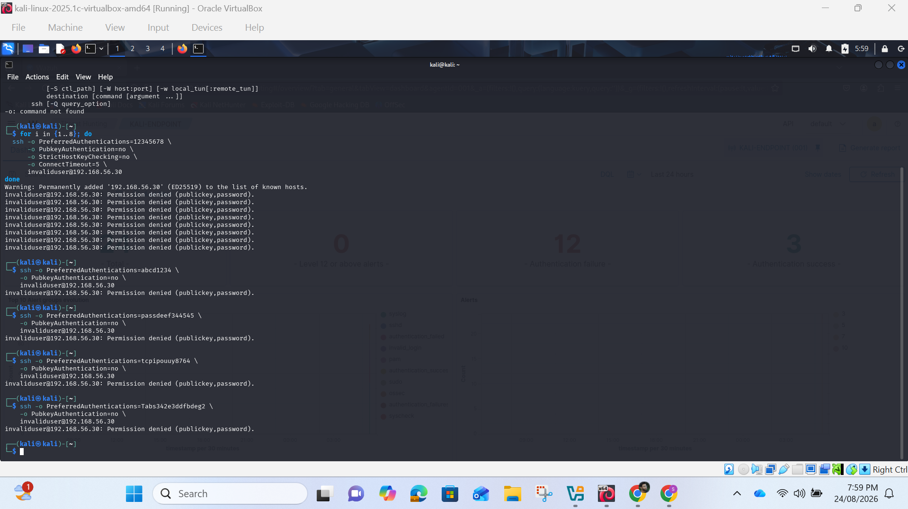
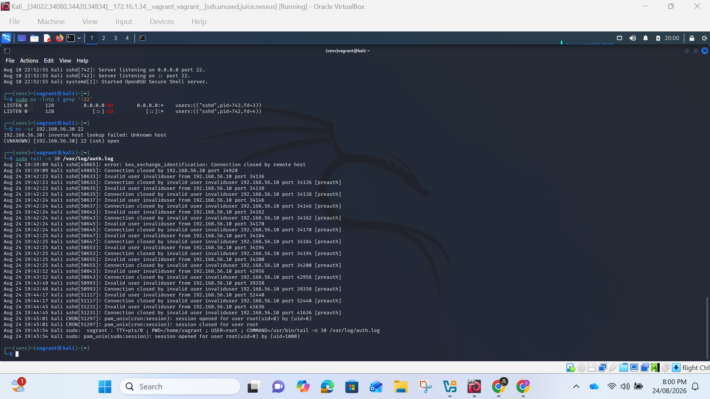
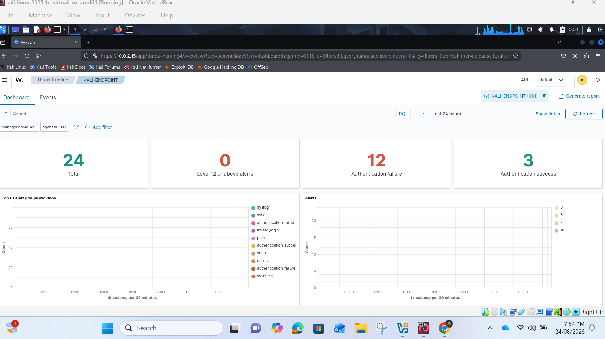
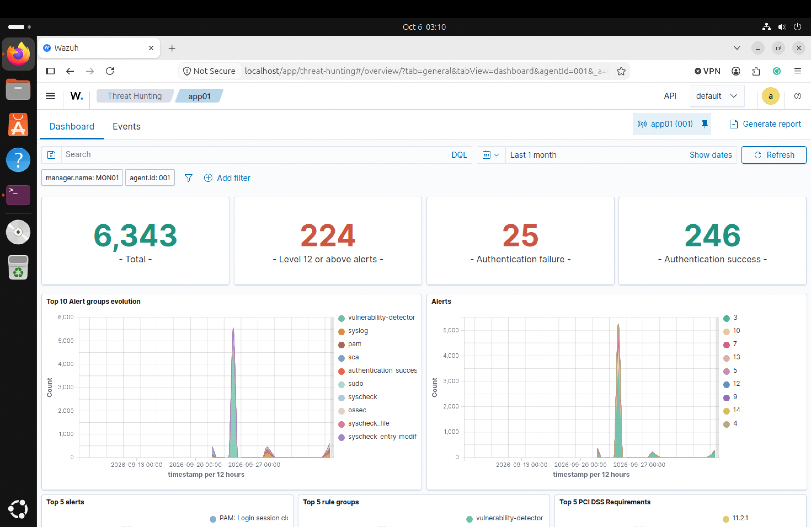

# Failed login Detection in Wazuh
  

  

  

## Explanation:  
It is crucial to monitor for failed-logins because multiple failed authentications might indicate password-guessing, brute-forcing, or use of compromised credentials or trying to obtain a legitimate username. A single failed-login is normal but when there are several such attempts in a short period of time, the source needs investigation. Centralized monitoring also generates evidence that is possible to review after an incident happened.  
As the example, I chose SSH authentication. The endpoint under monitoring has produced authentications' events in file /var/log/auth.log. From the controlled source address 192.168.56.10 I connected using an intentionally incorrect username "invaliduser". That helped me not to use any existing account accidentally. 
The following entries have been observed in the source logs:
Invalid user invaliduser from 192.168.56.10 port 34136  
Connection closed by invalid user invaliduser 192.168.56.10 port 34136 [preauth]  
These kinds of entries were observed for several source addresses in a very short period of time. The port changes every time because the client creates a new connection every time. The main fields to investigate were: Event time, Target Service(sshd), Invalid user name, Source IP address, Source port and [preauth] flag.  
The endpoint has firstly generated the SSH authentication event. Then the Wazuh agent has collected logs and sent them to the Wazuh manager. Wazuh has decoded the events, detected the pattern and matched with the authentication rules. The alerts were indexed and became visible in Threat Hunting tab on the dashboard.  
I chose to review the logs of agent number 001 during the last 24 hours. Dashboard has shown the following information:
• 24 Total Alerts  
• 12 authentication Failure Alerts  
• 3 authentication Success Alerts  
• No level 12+ alerts.  
The positive result means that all the local monitoring chain was working: the endpoint created the event, the agent collected it, Wazuh classified it and dashboard visualized it.  

# Failed and Successful Authentication during real life testing
  
