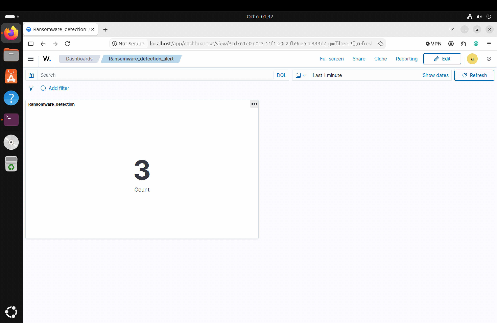

# Ransomware detection on MON01
  

## Ransomware Detection
Wazuh File Integrity Monitoring and the associated rules are utilized by MON01 to spot the ransomware-related activities performed on APP01. In the process of this test exercise, the script that was executed was locking files for demonstration purposes in the Nextcloud directory. Wazuh spotted these modifications of the files in a bulk fashion, creating 3 ransomware-related alerts, while the Dashboard registered 61 file-integrity-related incidents. The test files in question have been restored from the backup that is located on MinIO.  
