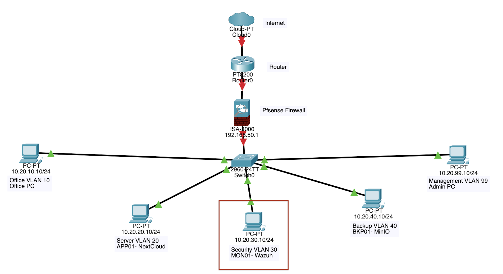

# Network Diagram alignment with Security Server
  

Security Monitoring System MON01 is a core of the project. It is placed in the separate Security VLAN 30 with the address 10.20.30.10; it separates monitoring services from user, application, backups and management services.  
The project components and MON01 are interconnected in the following ways:  
  
Application 01 monitoring: the Wazuh agent installed on APP01 transfers logs of authentication, file-integrity events, vulnerabilities information, results of CIS configuration and backup logs to MON01.  
--Failed log-in detection: MON01 discovers failures of APP01 authentication; it helps to determine whether there is any password guessings or unauthorized access.  
--File integrity monitoring: it monitors modifications of crucial Nextcloud files and directories. During the controlled ransomware simulation, MON01 detected 61 file-integrity events and created three ransomware-style alerts.  
--Monitoring of backups: APP01 sends the backup logs to MON01. The Wazuh dashboard registered five successes and nine failures of backup operations that helped the team to understand whether the scheduled Restic backup was finished.  
--BKP01 isolation: MON01 does not monitor BKP01; APP01 transfers the information about MinIO backups to MON01. In such way unnecessary contacts with the backup machine are avoided, and isolation of BKP01 is maintained.  
--pfSense integration: pfSense manages the connection between MON01 and other VLANs. There is only allowed necessary traffic, unrelated connections are blocked to minimize the lateral movement.  
--Detecting of incidents and supporting the recovery process: MON01 detects suspicious events and collects data concerning it, but it does not carry out neither the backup nor the restoration. This function is performed by Restic and MinIO, but MON01 provides alerts and the information needed to start the recovery process.  
  
In this way, MON01 connects all functions of prevention, detection and recovery. The prevention is provided by pfSense and access controls; MON01 provides central detection and visibility, and APP01-BKP01 backup integration provides recovery.  
