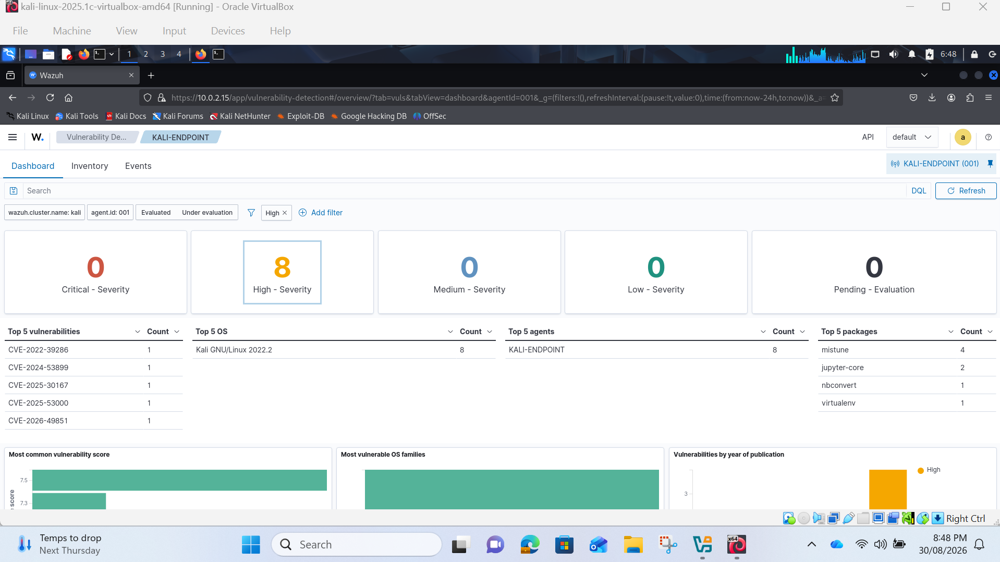
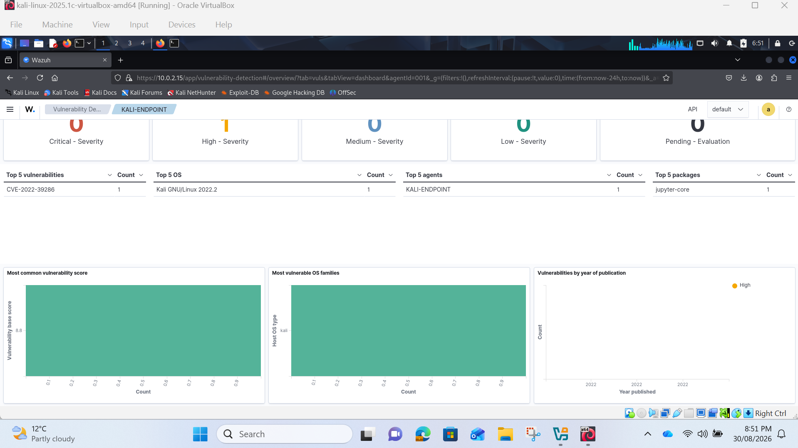
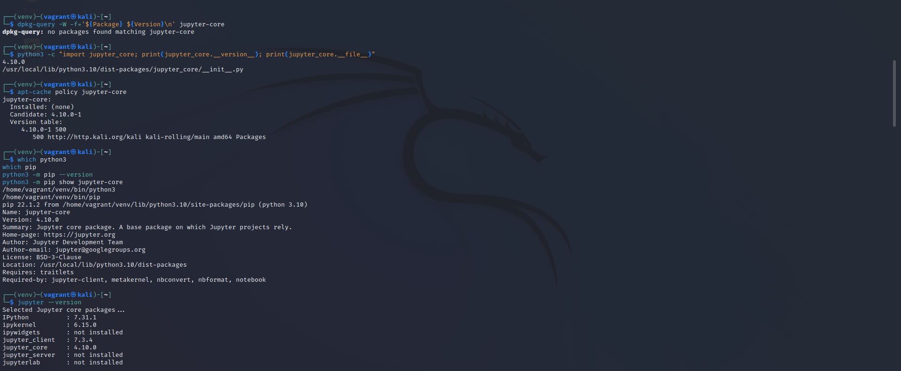
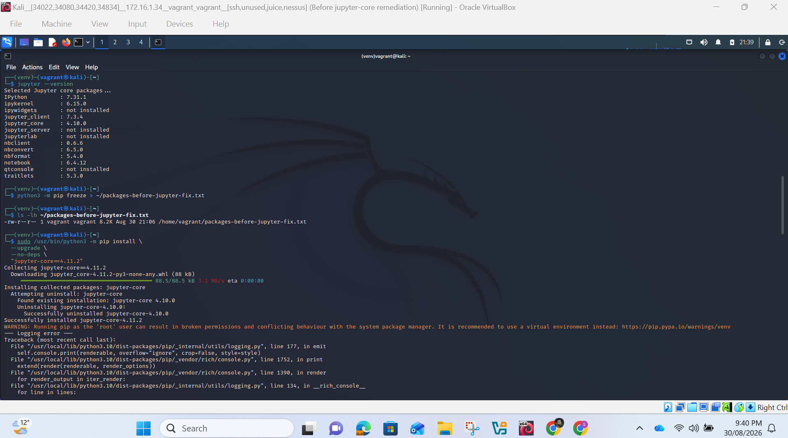
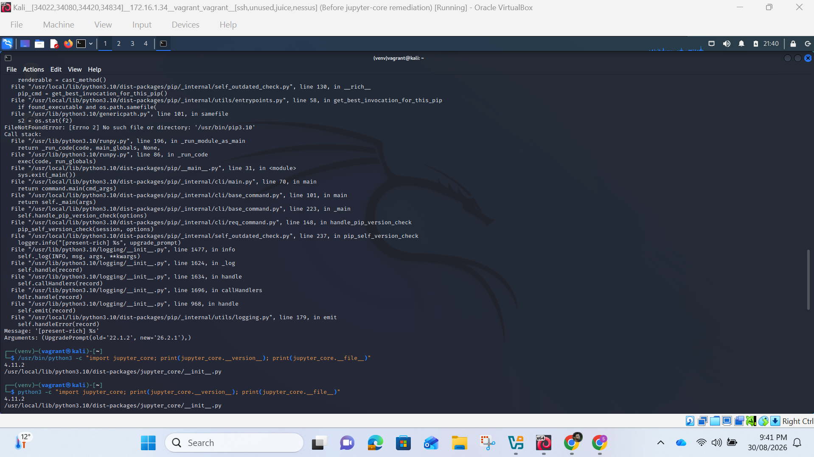
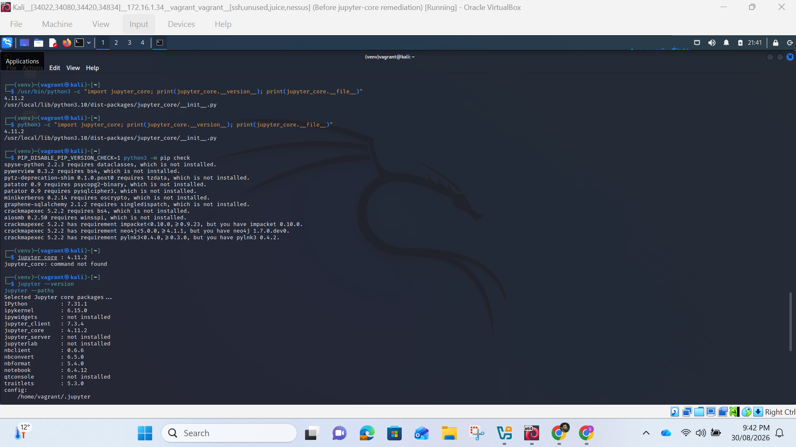
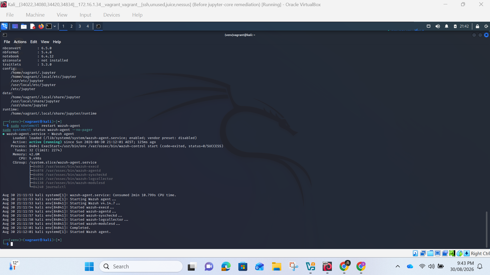
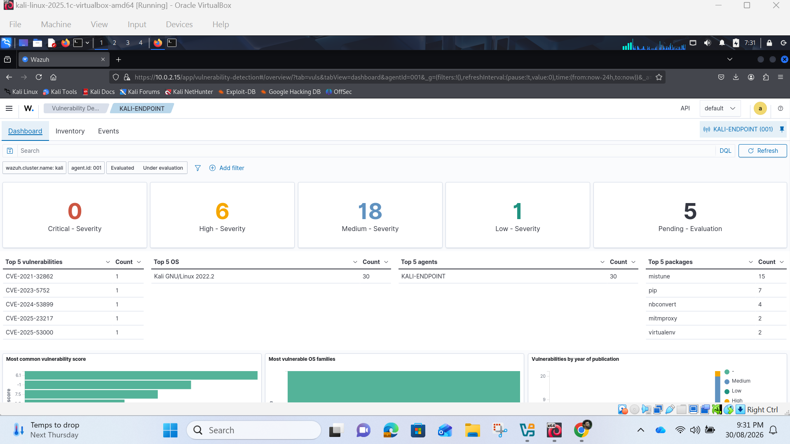

# Vulnerability Detection & Remediation
  
  
  
  
  
  
  

  

## Explanation:  
Vulnerability detection identifies installed software that may be affected by publicly known security weaknesses. Wazuh builds a software inventory from the endpoint and correlates package information with vulnerability intelligence. The dashboard can then present affected packages, CVE identifiers and severity information. This allows the team to prioritise remediation rather than updating packages without understanding the reason or risk.  
The initial dashboard displayed:  
•	0 critical vulnerabilities;  
•	8 high-severity vulnerabilities;  
•	17 medium-severity vulnerabilities; and  
•	1 low-severity vulnerability.  
 
The main affected packages shown included mistune, pip, nbconvert, jupyter-core and mitmproxy. I selected jupyter-core for a controlled remediation exercise. Before changing it, I verified how the package had been installed because the correct remediation method depends on package ownership.  
The investigation produced the following results:  
dpkg-query: no packages found matching jupyter-core  
However, Python reported:  
jupyter_core version: 4.10.0  
location: /usr/local/lib/python3.10/dist-packages  
apt-cache policy showed that the Debian/Kali package was not installed. This established that jupyter-core was a pip-managed Python package, not a package controlled by apt/dpkg. This investigation prevented me from applying an unsuitable remediation command.  
 
Before modifying the package, I completed two recovery preparations:  
1.	created a VirtualBox snapshot named Before jupyter-core remediation; and  
2.	exported the Python package state to ~/packages-before-jupyter-fix.txt using pip freeze.  
The snapshot provided a rollback point if the change damaged the VM. The package list provided a record of the software environment before the update.  
I then upgraded the selected package from version 4.10.0 to 4.11.2 using the system Python installation:
sudo /usr/bin/python3 -m pip install --upgrade --no-deps "jupyter-core==4.11.2"  
The output stated that version 4.10.0 was successfully removed and version 4.11.2 was successfully installed. A logging traceback appeared after installation because pip attempted to compare its executable with a missing /usr/bin/pip3.10. This warning occurred during pip's self-update check; it did not reverse the completed jupyter-core installation. Nevertheless, the warning shows that the Python environment contains mixed system and /usr/local components and should be handled cautiously.  
After the change, Wazuh refreshed its software inventory and vulnerability information. The later dashboard showed:  
•	0 critical findings;  
•	6 high findings;  
•	18 medium findings;  
•	1 low finding; and  
•	5 pending evaluation.  
 
Therefore, the number of high-severity findings decreased from 8 to 6. This demonstrates measurable improvement, but it should not be described as complete vulnerability removal. The medium count increased and some packages were still awaiting evaluation. Vulnerability totals can change when the inventory refreshes, vulnerability intelligence is updated or a finding changes severity classification.  

