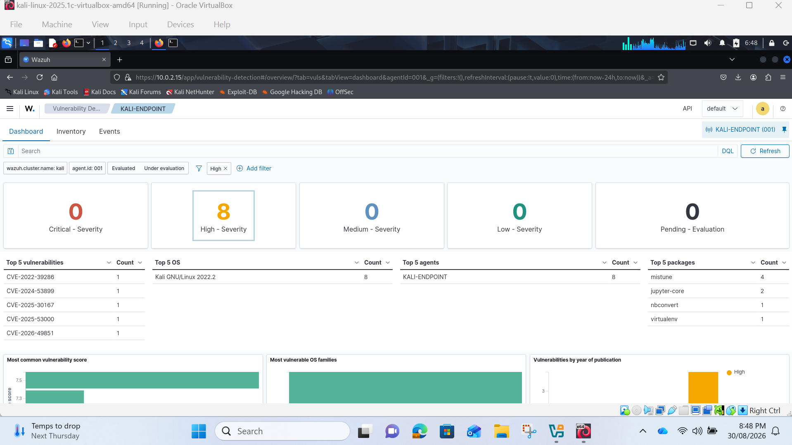
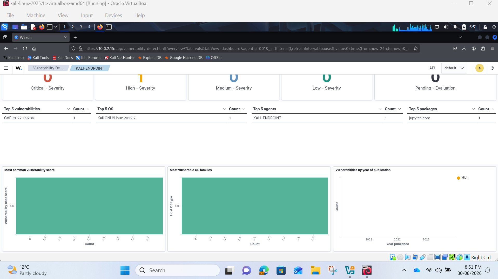
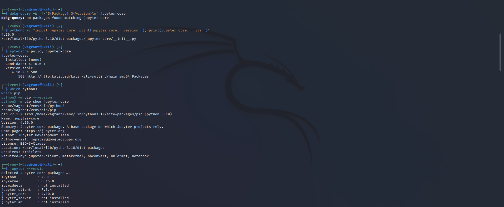
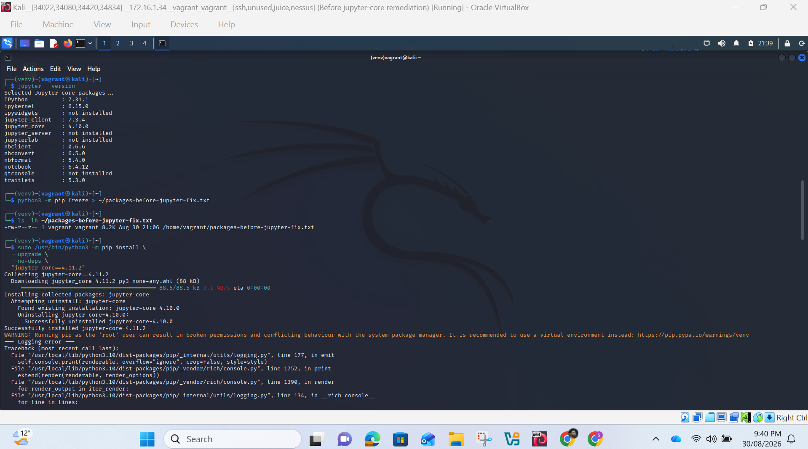
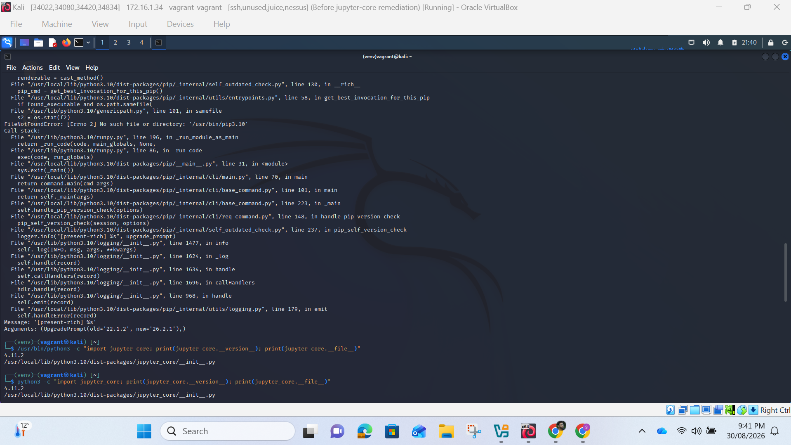
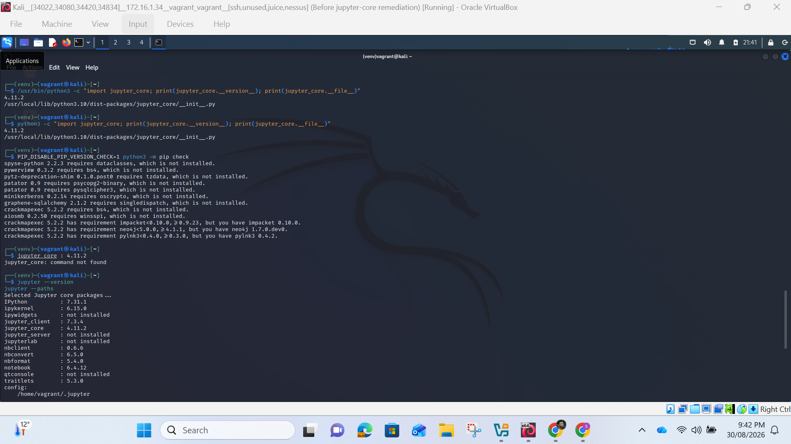
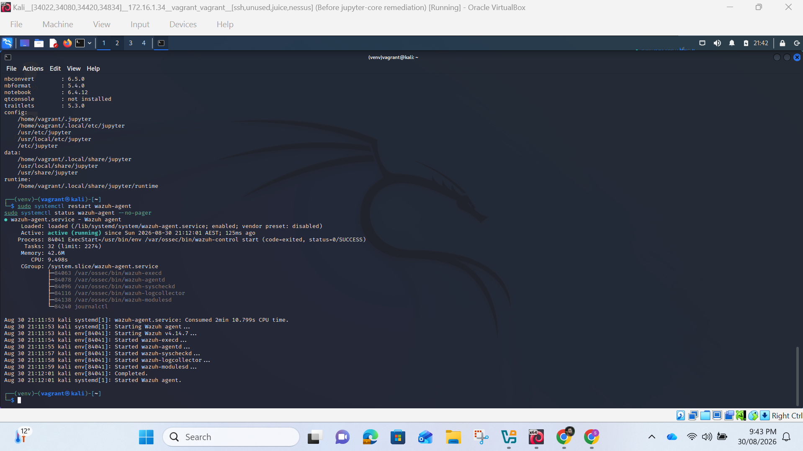

# Vulnerability Detection & Remediation
  
  
  
  
  
  
  

  

## Explanation:  
Vulnerability detection discovers software which is potentially vulnerable to known vulnerabilities. Wazuh uses endpoint's package information and matches them against vulnerability intelligence. In turn, the dashboard is able to show the impacted packages along with their corresponding CVEs and severity data. That makes it easier for the team to fix issues in priority, rather than patch the software for no reason and no risk.  
At first the dashboard showed the following data:  
0 critical vulnerabilities;  
8 high severity vulnerabilities;  
17 medium severity vulnerabilities;  
and 1 low severity vulnerability.  

Among those, the most affected packages included: mistune, pip, nbconvert, jupyter-core and mitmproxy. As for this exercise, I chose jupyter-core package for a careful remediation process. First of all, I needed to figure out how that package was installed, since a correct way of remediation depends on it.  
As a result, this investigation provided the following:  
dpkg-query: no packages found matching jupyter-core. 
However, python reported:  
jupyter_core version: 4.10.0  
location: /usr/local/lib/python3.10/dist-packages  
apt-cache policy also reported that there was no Debian/Kali package installed. Therefore, jupyter-core was a python package managed by pip, not an apt/dpkg one. This saved me from using an incorrect remediation command.  

As a part of preparation for package fixing, I performed 2 activities:  

Created a VirtualBox snapshot "Before jupyter-core remediation";  
Exported a Python package state into ~/packages-before-jupyter-fix.txt with pip freeze command.  
Snapshot was taken as a way of rollback for case if package modification has ruined my VM. Package list provided me with the record of software before changing.  
Then I fixed the selected package, upgrading it from 4.10.0 to 4.11.2 using system-wide Python: sudo /usr/bin/python3 -m pip install --upgrade --no-deps "jupyter-core==4.11.2".  
The output says that jupyter-core 4.10.0 was uninstalled, jupyter-core 4.11.2 was installed successfully. There was a traceback in log files after package update because pip tried to compare its executables with the missing /usr/bin/pip3.10 file. That happened due to self-update checking procedure and it doesn't revert already done jupyter-core update. However, this is a good indicator of the mixture of both system and /usr/local libraries within the Python environment and such mixture needs careful handling.  
Then I asked Wazuh to refresh software packages and vulnerabilities. Later the dashboard displayed the following information:  
0 critical findings;  
6 high findings;  
18 medium findings;  
1 low finding;  
5 pending evaluation.  
That shows the number of high severity findings reduced from 8 to 6. There are improvements but it cannot be considered as elimination of all vulnerabilities completely. Besides, a medium count increased while some packages are still to be evaluated. Vulnerabilities count may vary with each update of the inventory, vulnerability intelligence and/or severity classification of findings changes.  
