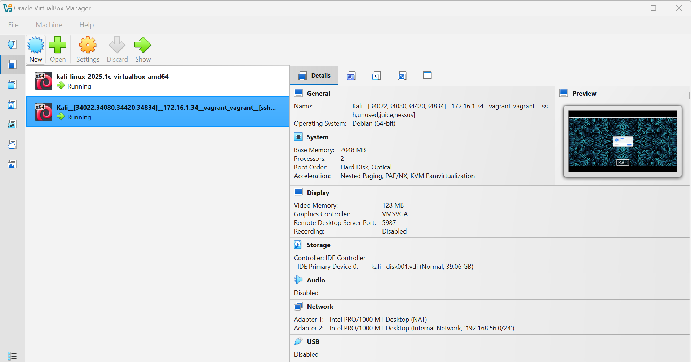
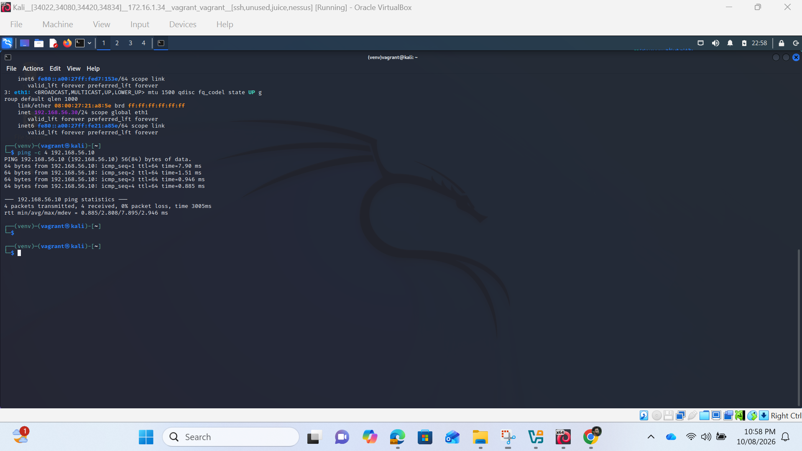
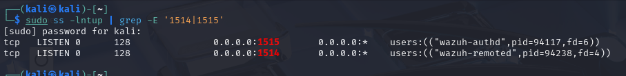
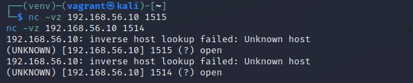
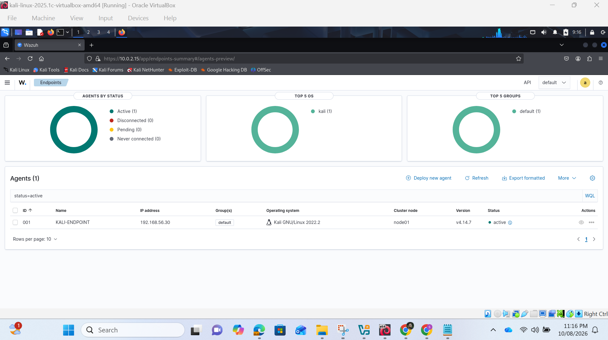
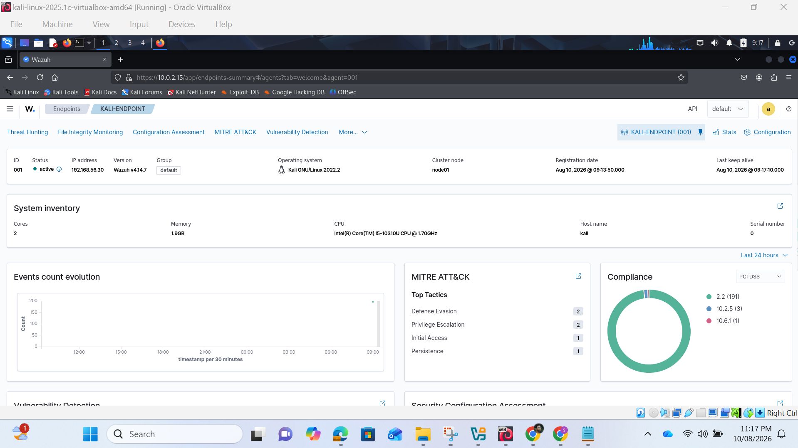

  
## Endpoint route and interface configuration  & Ping test   
  
## ss listener output on MON01  
  
## Netcat port tests from endpoint  
  
## Agent service and dashboard status  
  
## Endpoint security overview  
  
  
**Wazuh Agent Deployment on the Second Kali VM**
During the simulation, I created a second Kali Linux virtual machine to act as a monitored endpoint. I added the official Wazuh repository, installed the Wazuh agent package and configured the agent with the IP address of the first Kali VM running the Wazuh manager. I then enrolled the endpoint with the manager, enabled the agent service and started it. After confirming network connectivity over the required Wazuh ports, I verified that the new agent appeared as active on the Wazuh dashboard.  
The purpose of deploying this agent was to test communication between an endpoint and the central Wazuh monitoring server before working with the real APP01 system. The agent collected security information from the second Kali VM and forwarded it to MON01 for analysis. This allowed me to simulate and detect failed login attempts, file integrity changes, software vulnerabilities and CIS configuration weaknesses. The successful deployment confirmed that Wazuh could centrally monitor a remote endpoint and prepared me for deploying the agent on Shourabh’s APP01 server.  
