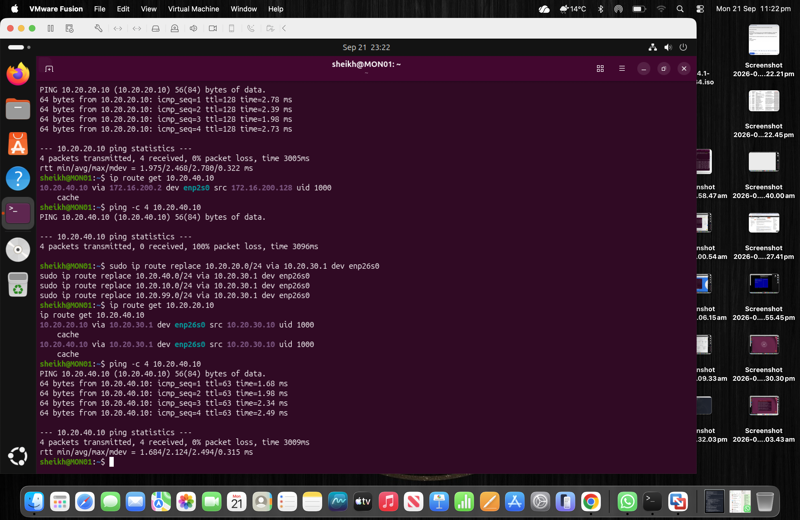
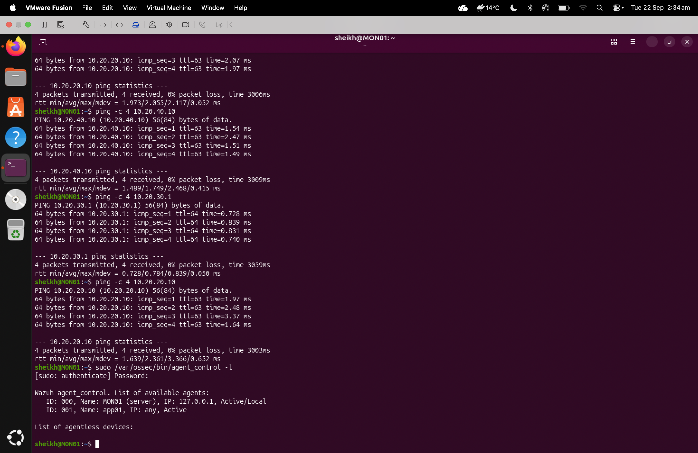
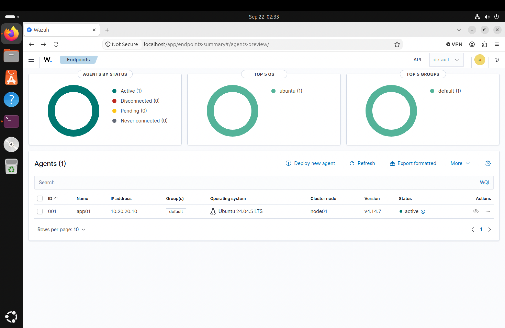

  

  

  

## Wazuh Agent Deployment on APP01
As for the final deployment, I installed Wazuh agent on Sourabh’s APP01 machine running on Ubuntu server. The Wazuh agent was set up using the IP of MON01, which is 10.20.30.10, by enrolling using the network under control pfSense. After verifying that the connectivity on port 1514 and port 1515 of the Wazuh agent works, I enabled and started the Wazuh agent service. Thus, APP01 appeared as one of the active endpoints on the MON01 dashboard.  
