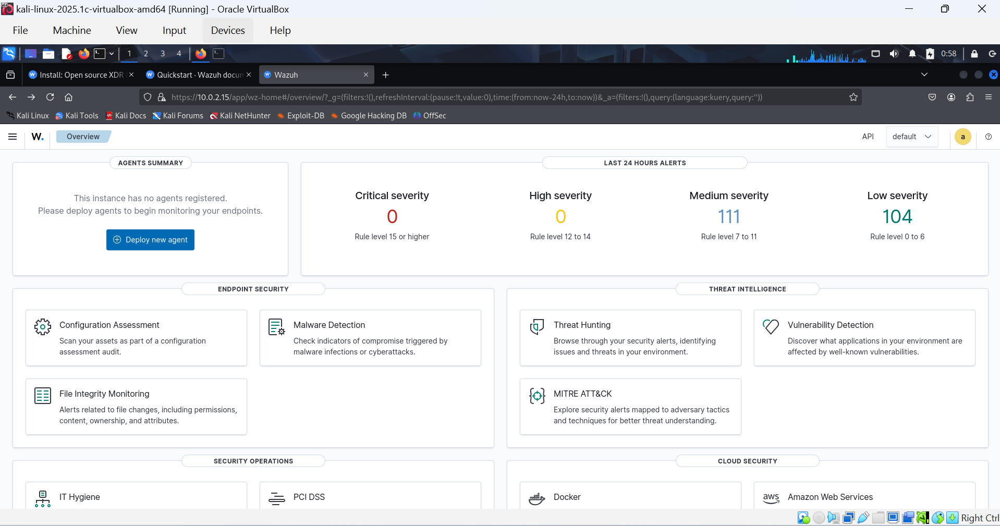
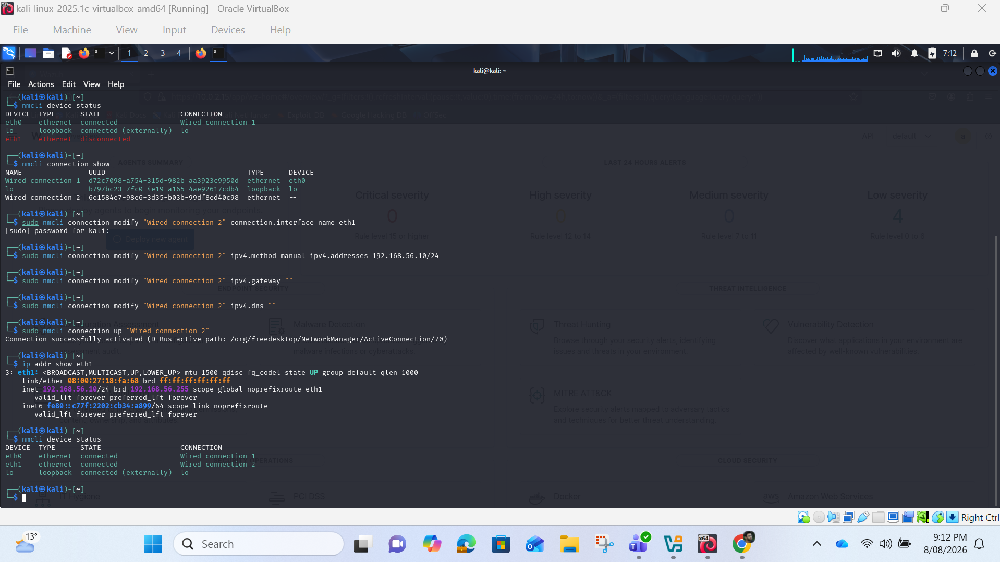

## MON01 Wazuh dashboard  
  

  

**Wazuh Dashboard Installation on Kali Linux VM**  
During the simulation stage, I created a Kali Linux virtual machine using Oracle VirtualBox. I downloaded the Wazuh installation assistant and ran it with administrative privileges to install the Wazuh manager, indexer and dashboard together on the VM. After installation, I confirmed that the Wazuh services were running and accessed the dashboard through a web browser using the MON01 IP address and the generated administrator credentials.  
The purpose of this installation was to create an isolated monitoring environment before connecting the real project systems. It allowed me to learn the Wazuh deployment process, test agent enrolment and confirm that security events were visible on the dashboard.  
