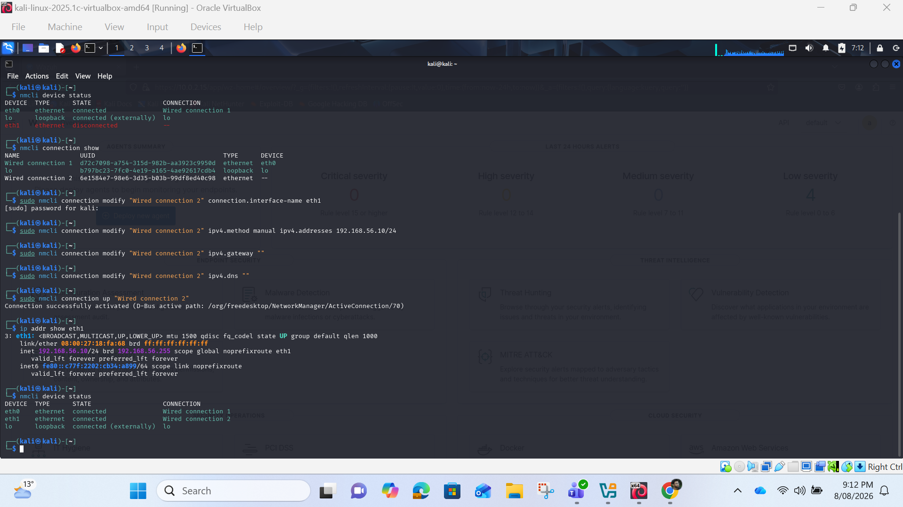
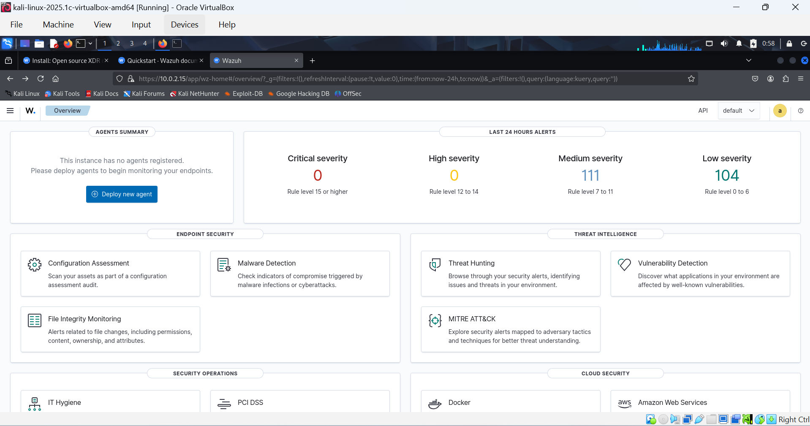
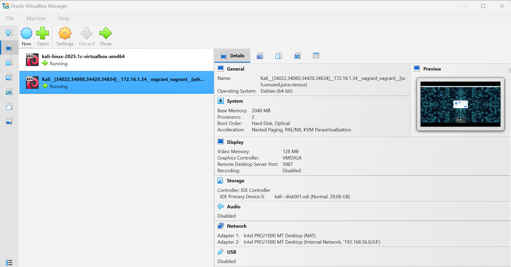
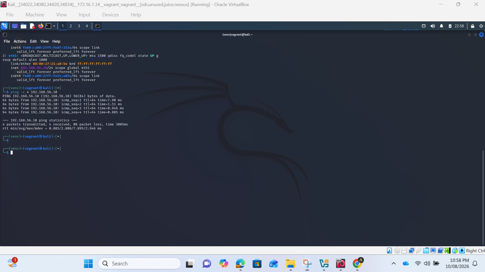
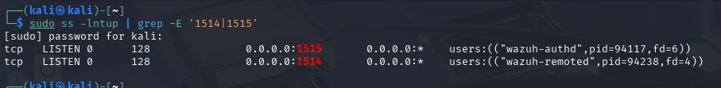
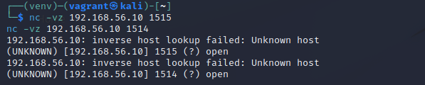
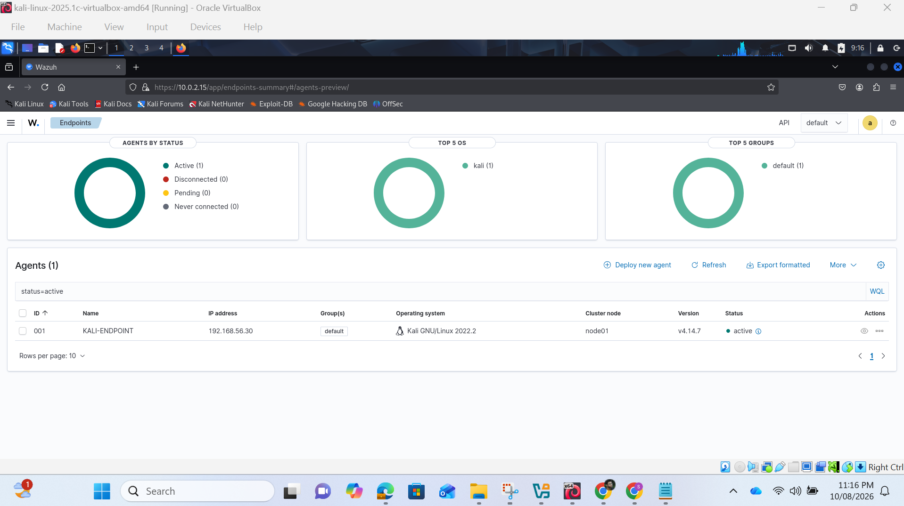
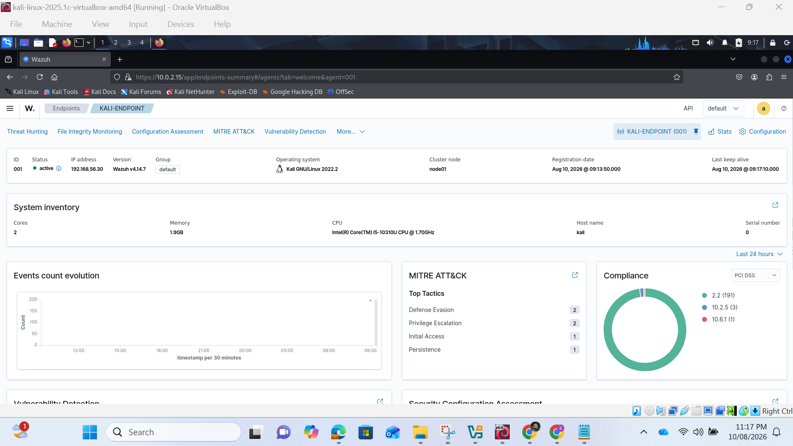

# Evidences Progress Report 1  

## MON01 ip addr / nmcli output  
  
## MON01 Wazuh dashboard  
  
## VirtualBox network settings  
  
## Endpoint route and interface configuration  & Ping test   
  
## ss listener output on MON01  
  
## Netcat port tests from endpoint  
  
## Agent service and dashboard status  
  
## Endpoint security overview  
  
  

